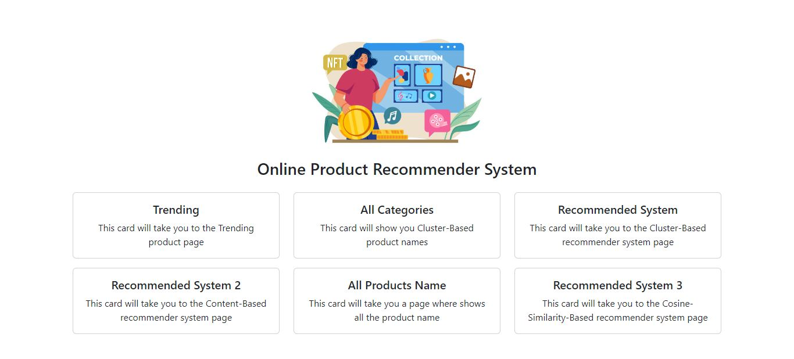
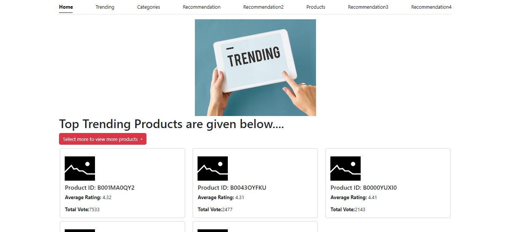
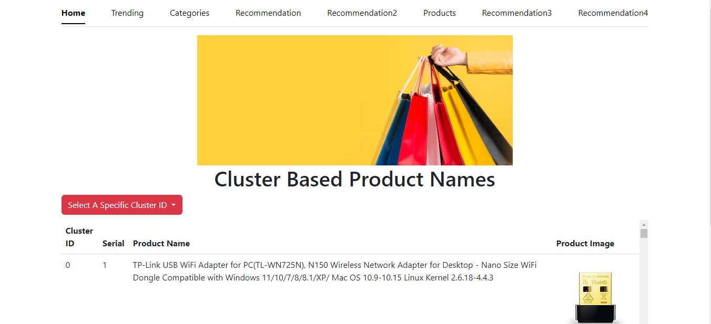
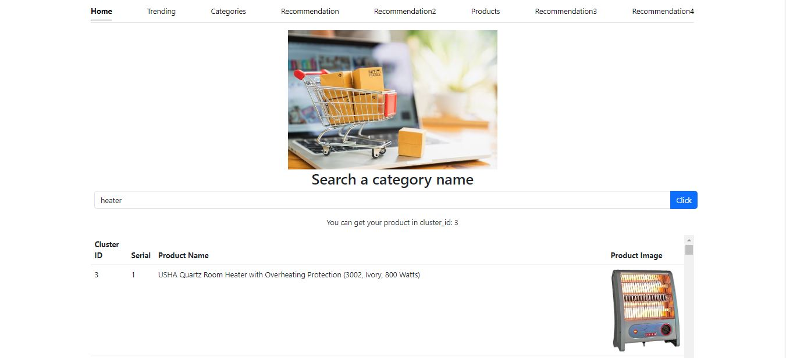
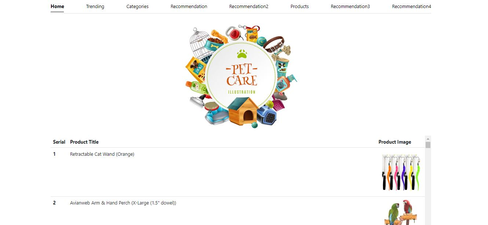
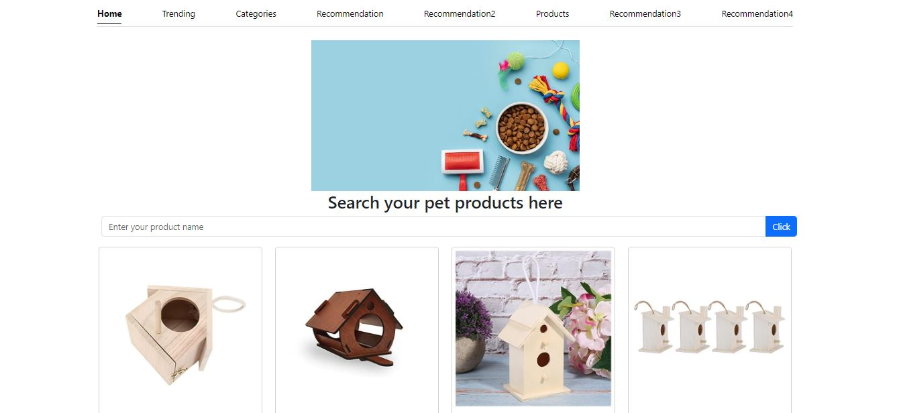
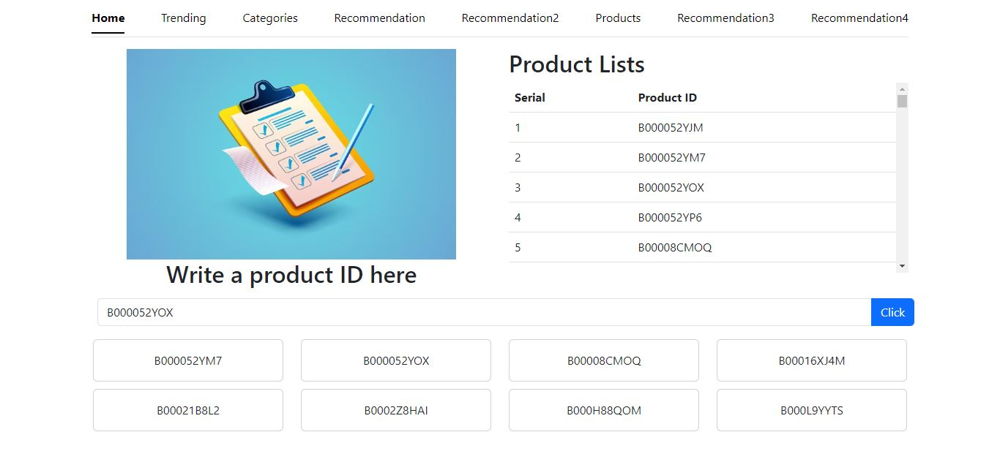

# Product_Recommendation_System_for_an_E-commerce_Website
<h3>Here I provide the UI design of my project</h3>

This is the homepage of our project

On this page, people find trending products

On this page, people find group-wise item names

Here people search for an item name and get a group of items with details 

On this page, people find all kinds of pet products

Here, people find similar pet products together

This page recommends products based on an analytics user's previous preference history.

